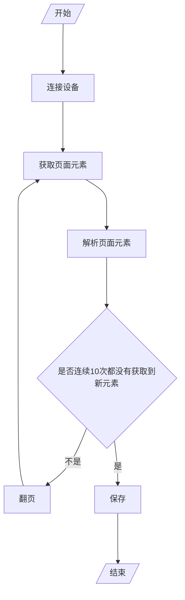

## 爬虫部分

### 目前采用的方法

鉴于阿里的反人机机制做得非常好，在探索之后我决定使用 Android 自动化工具配合 Python 脚本的方式获取评论数据。

#### 原理

使用 Android 自带的工具 UI Automator 能够导出当前页面的 UI 层次结构快照，这其中就包含了我们需要的评论数据。

使用基于 UI Automator 的 uiautomator 库替代单纯的命令行调用 ADB，可以做到更流畅的设备操纵。不过由于 uiautomator 年久失修，我们使用它的后继者 uiautomator2 。

替选方案还有 [Appium](https://appium.io/) 配上 Appium-Python-Client 库，使用体验基本同 selenium，但环境配置稍显麻烦 —— 并且这么简单的任务还不至于用到它。与 uiautomator2 相比的速度还没有测试过。

#### 流程

流程其实很简单：

由于不确定 APP 的页面会如何变化，我们没有编写自动导航到商品页和评论页的功能。要开始一个评论区的采集，需要手动打开评论页，然后告诉程序开始采集。

效率略低（大约 `16it/min` ），这也是没办法的事。不过挂机效果还不错？目前在采集过程中还没有弹出过人机验证。

#### 信息提取

UI XML 文件的结构相对比较难处理，因此使用了比较简单粗暴的方法。

主要是用正则表达式，定位文件中一些内容格式相对固定的节点，然后根据这些节点与有效信息节点的相对位置得到信息。

由于只需要日期与评论内容，于是只是简单写了写，特殊格式的评论也没做处理（）

### 废案

#### selenium

电脑版网页端现在有评论条数加载上限了 ~~，毙掉~~

使用手机浏览器的 UA 配上 selenium 似乎不错，能得到手机版网页端的页面。不过即使解决了「使用 selenium 控制浏览器时登录会无法通过人机验证」的问题，在采集过程中的人机验证仍然非常频繁，几乎是下翻一页就弹一次，完全没法用。 ~~并且我在尝试这个的时候被封了一个小号 😡~~

#### 抓包

使用特殊手段破除客户端的 https 加密后抓包，发现评论数据是通过分块下载一个文件头为`alidx`的专有加密文件到达客户端的，以我的水准无法破解，于是作罢。
